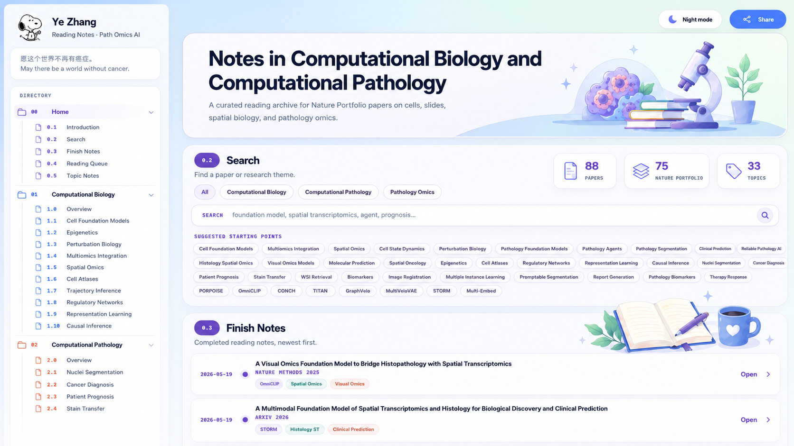

# 📚 PathOmics Literature Notes


<p align="center">
  <a href="https://zhangye-zoe.com/notes/">
    
  </a>
  
  
  
</p>


**PathOmics Notes** collects structured paper summaries, key figures, method insights, and topic-level notes around AI-driven biomedical research, with a focus on cancer biology and precision medicine.

**Website:** [https://zhangye-zoe.com/notes/](https://zhangye-zoe.com/notes/)

<p align="center">
  <a href="https://zhangye-zoe.com/notes/">
    
  </a>
</p>


## ✨ Highlights

| Area | Focus |
|---|---|
| 🧬 **Computational Biology** | Single-cell omics, spatial omics, perturbation biology, cell foundation models, regulatory networks, and multi-omics integration. |
| 🔬 **Computational Pathology** | WSI analysis, nuclei segmentation, pathology foundation models, report generation, reliable pathology AI, and multimodal diagnosis. |
| 🧫 **Pathology Omics** | Histology-spatial omics integration, molecular prediction from pathology images, visual-omics models, biomarkers, and spatial oncology. |
| 📝 **Topic Notes** | Synthesis-style notes connecting related papers, methods, datasets, and research questions. |

## 🗂️ Main Topics

```text
Computational Biology     Computational Pathology     Pathology Omics
├─ Cell Foundation Models ├─ WSI Analysis              ├─ Histology-Spatial Omics
├─ Spatial Omics          ├─ Foundation Models         ├─ Visual-Omics Models
├─ Multi-omics            ├─ Nuclei Segmentation       ├─ Molecular Prediction
├─ Perturbation Biology   ├─ Pathology LLMs            ├─ Biomarkers
├─ Trajectory Inference   ├─ Report Generation         ├─ Therapy Response
└─ Regulatory Networks    └─ Reliable Pathology AI     └─ Spatial Oncology
```